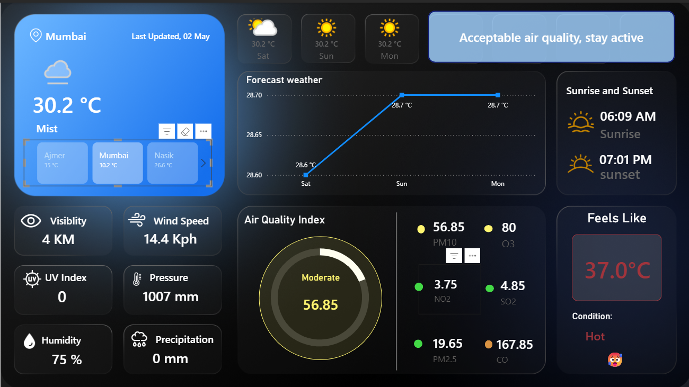

# Real-Time-Weather-Analytics-Dashboard

# Problem Statement
Understanding real-time weather conditions and air quality is crucial for environmental monitoring and decision-making. This dashboard provides a centralized, interactive solution to track and analyze key weather and pollution metrics across multiple cities.

# Features
- Multi-City Weather Monitoring
Real-time weather data tracking across multiple cities (Ajmer, Mumbai, Nasik) with side-by-side comparison cards enabling quick assessment of temperature variations and weather conditions across locations.
- Real-Time Data Integration & Auto-Refresh
Live weather API integration with automatic refresh capability ensures dashboard displays current meteorological conditions without manual intervention. Supports continuous monitoring for operational efficiency.
- 3-Day Forecast & Trend Analysis
Interactive line chart visualizing temperature and weather trends over 3 days with trend indicators, enabling predictive insights for planning and decision-making.

- Intelligent Temperature Metrics

Current Temperature with location-based display
"Feels Like" Calculation incorporating humidity and wind chill factors
Temperature Variability tracking day-to-day changes
Weather Condition Status (Clear, Cloudy, Rainy, etc.)

- Comprehensive Air Quality Index (AQI) Analysis

AQI Gauge Visualization with color-coded status levels (Good/Moderate/Unhealthy)
Pollutant Tracking: PM10, PM2.5, NO2, SO2, CO, O3 with individual metric cards
Environmental Health Assessment providing actionable air quality recommendations
Month-over-Month Comparison showing air quality trends

- Sunrise & Sunset Timing Dashboard
Displays precise sunrise and sunset times with daylight duration calculations, supporting time-sensitive planning and health monitoring applications.

- Advanced Weather Parameters Dashboard
Real-time monitoring of 6+ meteorological metrics:
Wind Speed (with direction indicators)
Humidity levels & patterns
Atmospheric Pressure trends
Visibility range for safety assessment
UV Index for sun exposure alerts
Precipitation measurements & forecasts

- Interactive & Dynamic Visualizations

Responsive KPI Cards with real-time metric updates
Location-Based Filtering for focused analysis
Drill-Down Capabilities for detailed data exploration
Cross-Filtering between visualizations for integrated insights
Clean Modern Interface optimized for quick decision-making

- Intelligent Color-Coding & Visual Indicators

AQI Color Scale: Green (Good) → Orange (Moderate) → Red (Unhealthy) for instant status recognition
Weather Condition Icons for visual clarity
Temperature Heatmaps showing regional variations
Conditional Formatting for critical alerts

- Robust Data Architecture & Processing

Power Query ETL Pipeline: Comprehensive data cleaning, validation, and standardization

- Advanced DAX Measures:

AQI status classification logic
Temperature variability calculations
"Feels like" temperature formula incorporating multiple factors
Month-over-month percentage changes
Extreme weather event tracking

Optimized Data Models for real-time performance

# Tech Stack

| Tool | Purpose |
|------|---------|
| **Power BI** | Interactive dashboard & visualizations |
| **Power Query** | Data cleaning & ETL |
| **DAX** | Complex calculations & measures |
| **Weather APIs** | Real-time meteorological data |

# How It Works

- Data is fetched from weather APIs in real time
- Power Query is used for data transformation and cleaning
- DAX measures calculate derived metrics like AQI levels and temperature variations
- Visuals update dynamically with filters and refresh

# Dashboard Preview

# Data Refresh

- **Desktop:** Ctrl + R
- **Service:** Auto-refresh every 30 minutes
- **Manual:** Refresh button on dashboard

